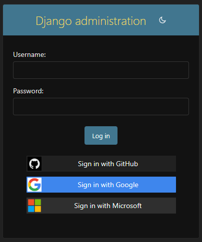

# Using Multiple Social Logins

A special advanced case is when you need to login from multiple social providers. In this case, each provider will have its own
package which you need to install and configure:

* [Django Google SSO](https://github.com/megalus/django-google-sso)
* [Django Microsoft SSO](https://github.com/megalus/django-microsoft-sso)

## Install the Packages
Install the packages you need:

```bash
pip install django-google-sso django-microsoft-sso

# Optionally install Stela to handle .env files
pip install stela
```

## Add Package to Django Project
To add this package in your Django Project, please modify the `INSTALLED_APPS` in your `settings.py`:

```python
# settings.py

INSTALLED_APPS = [
    # other django apps
    "django.contrib.messages",  # Need for Auth messages
    "django_microsoft_sso",  # First button in login page
    "django_google_sso",  # Second button in login page
]
```

!!! tip "Order matters"
    The first package on list will be the first button in the login page.

## Add secrets to env file

```bash
# .env
GOOGLE_SSO_CLIENT_ID=999999999999-xxxxxxxxx.apps.googleusercontent.com
GOOGLE_SSO_CLIENT_SECRET=xxxxxx
GOOGLE_SSO_PROJECT_ID=999999999999

MICROSOFT_SSO_APPLICATION_ID=FOO
MICROSOFT_SSO_CLIENT_SECRET=BAZ
```

### Setup Django URLs
Add the URLs of each provider to your `urls.py` file:

```python
from django.urls import include, path


urlpatterns += [
    path(
        "microsoft_sso/",
        include("django_google_sso.urls", namespace="django_microsoft_sso"),
    ),
    path(
        "microsoft_sso/",
        include("django_microsoft_sso.urls", namespace="django_microsoft_sso"),
    ),
]
```

### Setup Django Settings
Add the settings of each provider to your `settings.py` file:

```python
# settings.py
from stela import env

# Django Microsoft SSO
MICROSOFT_SSO_ENABLED = True
MICROSOFT_SSO_APPLICATION_ID = env.MICROSOFT_SSO_APPLICATION_ID
MICROSOFT_SSO_CLIENT_SECRET = env.MICROSOFT_SSO_CLIENT_SECRET
MICROSOFT_SSO_ALLOWABLE_DOMAINS = ["contoso.com"]

# Django Google SSO
GOOGLE_SSO_ENABLED = True
GOOGLE_SSO_CLIENT_ID = env.GOOGLE_SSO_CLIENT_ID
GOOGLE_SSO_PROJECT_ID = env.GOOGLE_SSO_PROJECT_ID
GOOGLE_SSO_CLIENT_SECRET = env.GOOGLE_SSO_CLIENT_SECRET
GOOGLE_SSO_ALLOWABLE_DOMAINS = ["contoso.net"]
```

The login page will look like this:



### The Django E003/W003 Warning
If you are using both **Django Google SSO** and **Django Microsoft SSO**, you will get the following warning:

```
WARNINGS:
?: (templates.E003) 'show_form' is used for multiple template tag modules: 'django_google_sso.templatetags.show_form', 'django_microsoft_sso.templatetags.show_form'
?: (templates.E003) 'sso_tags' is used for multiple template tag modules: 'django_google_sso.templatetags.sso_tags', 'django_microsoft_sso.templatetags.sso_tags'
```

This is because both packages use the same template tags. To silence this warning, you can set the `SILENCED_SYSTEM_CHECKS` as per Django documentation:

```python
# settings.py
SILENCED_SYSTEM_CHECKS = ["templates.E003"]
```

But if you need to check the templates, you can use the `SSO_USE_ALTERNATE_W003` setting to use an alternate template tag. This alternate check will
run the original check, but will not raise the warning for the Django SSO packages. To use this alternate check, you need to set both the Django Silence Check and `SSO_USE_ALTERNATE_W003`:

```python
# settings.py

SILENCED_SYSTEM_CHECKS = ["templates.E003"]  # Will silence original check
SSO_USE_ALTERNATE_W003 = True  # Will run alternate check
```
