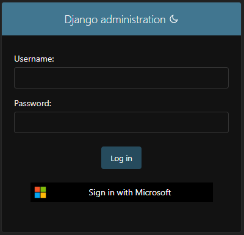

# Quick Setup

## Setup Django Settings

To add this package in your Django Project, please modify the `INSTALLED_APPS` in your `settings.py`:

```python
# settings.py

INSTALLED_APPS = [
    # other django apps
    "django.contrib.messages",  # Need for Auth messages
    "django_microsoft_sso",  # Add django_microsoft_sso
]
```

## Setup Microsoft Entra Credentials

To configure django-microsoft-sso, you will need to access _Microsoft Administration Center_ pages for Entra and Azure
services.

### The Application ID

First, go to [Microsoft Entra Administration Center](https://entra.microsoft.com/?l=en.en-us#home) and navigate
to [App registrations page](https://portal.azure.com/#blade/Microsoft_AAD_RegisteredApps/ApplicationsListBlade). You can
use an existing Application, or create a new one.
Then, in the **Application Overview** page, from Application you want to use, annotate his **Application (client) ID**.

### The Application Client Secret

Then, click on select application, navigate to **Certificate & secrets** link, and get the **Client Secret Value**
from that page.

With these information, please add the credentials in your settings.py:

```python
# settings.py

MICROSOFT_SSO_APPLICATION_ID = "your Application ID here"
MICROSOFT_SSO_CLIENT_SECRET = "your Client Secret Value here"
```

## Setup Callback URI

In [Microsoft Console](https://console.cloud.microsoft.com/apis/credentials) at _Api -> Credentials -> Oauth2 Client_,
add the following _Authorized Redirect URI_: `https://your-domain.com/microsoft_sso/callback/`
replacing `your-domain.com`
with your
real domain (and Port). For example, if you're running locally, you can
use `http://localhost:8000/microsoft_sso/callback/`.

!!! tip "Do not forget the trailing slash!"

## Setup Auto-Create Users

The next option is to set up the auto-create users from Django Microsoft SSO. Only emails with the allowed domains will be
created automatically. If the email is not in the allowed domains, the user will be redirected to the login page.

```python
# settings.py

MICROSOFT_SSO_ALLOWABLE_DOMAINS = ["your-domain.com"]
```

## Setup Django URLs

And in your `urls.py` please add the **Django-Microsoft-SSO** views:

```python
# urls.py

from django.urls import include, path

urlpatterns = [
    # other urlpatterns...
    path(
        "microsoft_sso/", include(
            "django_microsoft_sso.urls",
            namespace="django_microsoft_sso"
        )
    ),
]
```

## Run Django migrations

Finally, run migrations

```shell
$ python manage.py migrate
```

---

And, that's it: **Django Microsoft SSO** is ready for use. When you open the admin page, you will see the "Login with
Microsoft" button:

=== "Light Mode"
    

=== "Dark Mode"
    

??? question "How about Django Admin skins, like Grappelli?"
**Django Microsoft SSO** will works with any Django Admin skin which calls the original Django login template, like
[Grappelli](https://github.com/sehmaschine/django-grappelli), [Django Jazzmin](https://github.com/farridav/django-jazzmin),
[Django Admin Interface](https://github.com/fabiocaccamo/django-admin-interface)
and [Django Jet Reboot](https://github.com/assem-ch/django-jet-reboot).

If the skin uses his own login template, the "Login with Microsoft" button will not be displayed.

---

For the next pages, let's see each one of these steps with more details.
